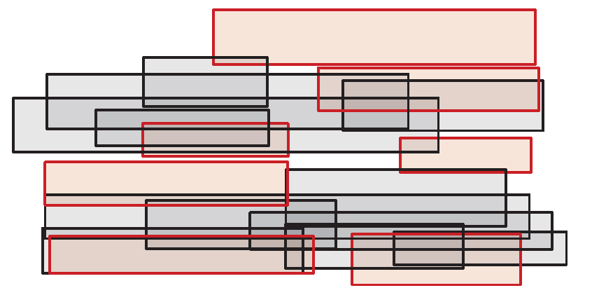

# Labeling Problem

An important task of most map applications is to show relevant labels, such as street names and points of interest, to the user. However, it is usually not possible to show all available labels at the same time due to the obvious cluttering, possibly turning the map unreadable. In this context, it would be interesting to develop an algorithm able to decide which labels to display. A simplified version of one such problem can be defined as follows:

> **Labeling Problem**. Let *L* be the set of available labels such that for each label *l* ∈ *L* there is an associated axis-parallel bounding box <i>bl</i>. Notice that the label, and its bounding box, are already set in place and therefore, cannot be moved. A feasible solution to the Labeling Problem is a subset *L'* 0 ⊆ *L* such that ∀*i, j* ∈ *L* 0 , *i* &ne; *j* ⇒ <i>bl</i> ∩ <i>bj</i> = ∅.

See Figure 1 for an example.

Figure 1: Example of an instance and a feasible solution for the Labeling Problem. Each rectangle corresponds to the bounding box <i>bl</i>  of a label *l* ∈ *L*. The rectangles in red comprise a feasible solution to the instance.

a) Write a complete computer program, using your preferred programming language, that, given an input representation, is able to find a feasible solution to the labeling problem stated above. You can decide on the input representation that better suits your algorithm needs.

b) Consider we want to maximize |*L'*|. Can you provide a bound on the quality of the solution found by your algorithm when compared to the optimum solution? If so, justify the provided bound. If not, justify why not.